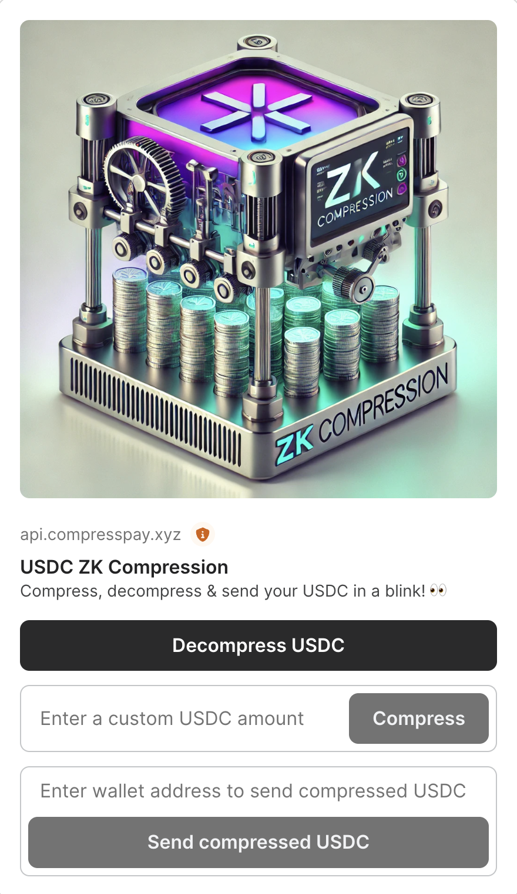

# Solana ZK Compression Actions & Blinks

## Overview

This project experiments with Solana's cutting-edge technologies: [ZK Compression](https://www.zkcompression.com/) by Light Protocol & Helius, reducing token storage costs by 5000x, and [Actions & Blinks](https://www.dialect.to/actions) by Dialect & Solana Foundation, which enables blockchain interactions with social networks.

**DISCLAIMER**: ***This repository has not been audited. Use at your own risk.***

## Screenshot

## Features
The main function of this project is to compress, decompress, and send compressed USDC token — the most popular stablecoin on the Solana network today.

## Usage
You can use this product directly through [a Blink on X/Twitter](https://x.com/tuanpmhd/status/1843266028211757295) or via Dialect’s public Blinks registry [here](https://dial.to/?action=solana-action%3Ahttps%3A%2F%2Fapi.compresspay.xyz%2Fapi%2Factions%2Fcompress-spl-token%2Fusdc&cluster=mainnet).

## Acknowledgements
Special thanks to the teams at Light Protocol, Helius, and Dialect for their support, infrastructure, documentation, and comprehensive libraries.

Additional thanks to [Airship](https://github.com/helius-labs/airship) and [Solana ZK Compressed Token Wallet](https://github.com/gitteri/solana-zk-compression) projects for their open-source repositories shared with the community.

For more information or support, please open an issue on the GitHub repository.

